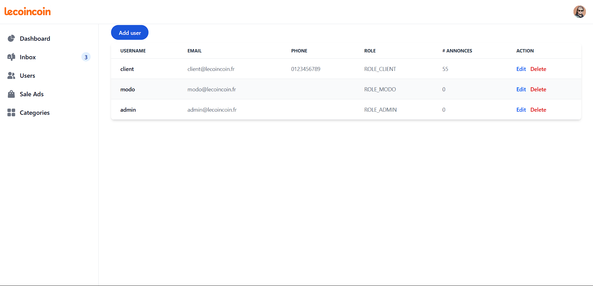
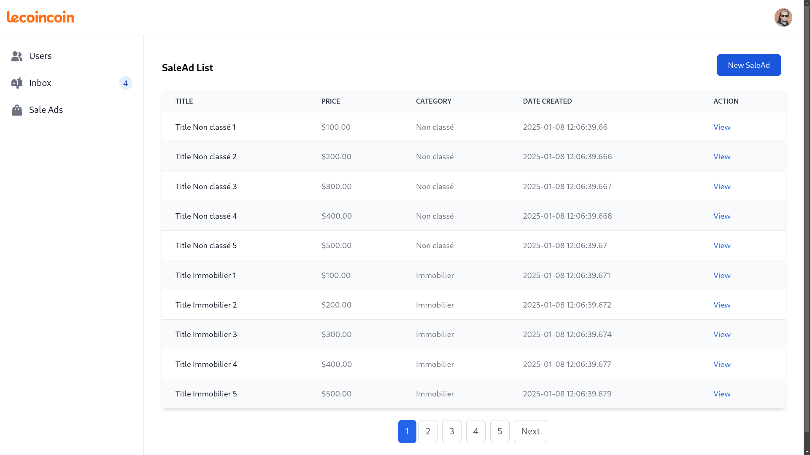
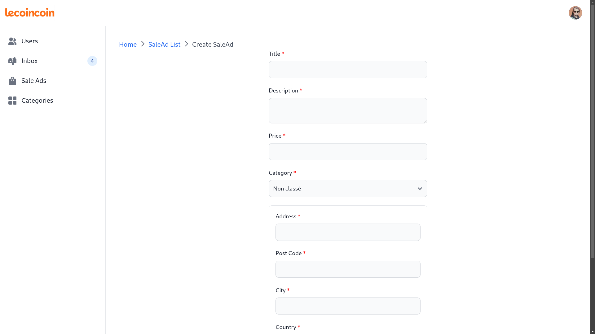
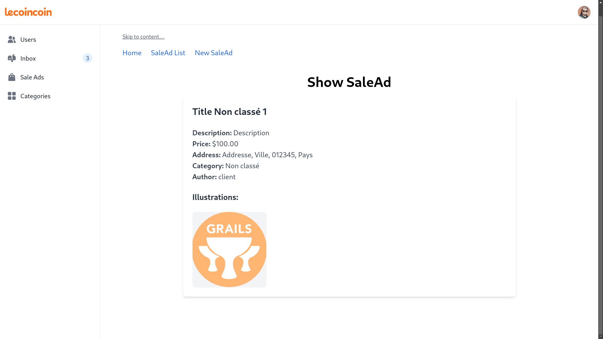
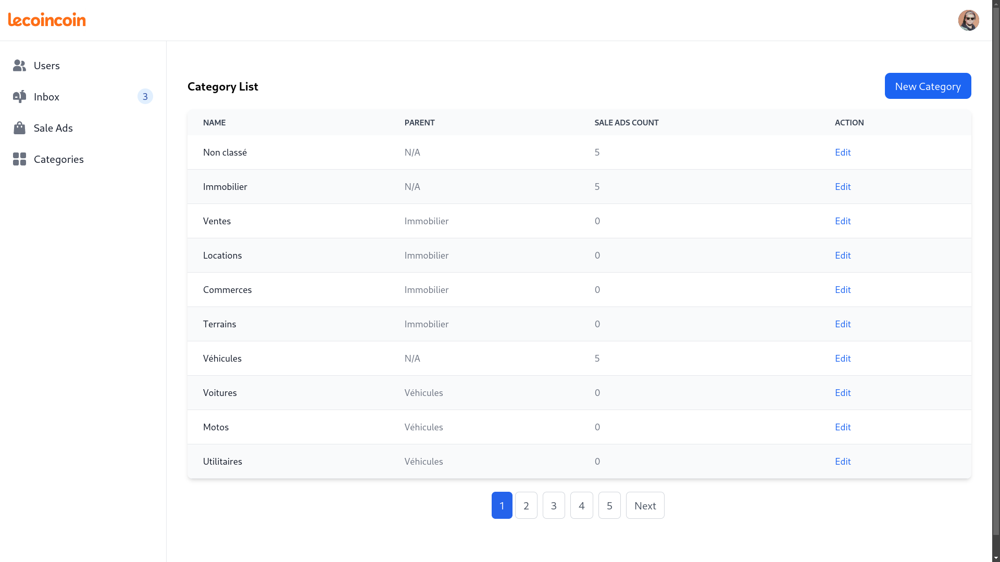
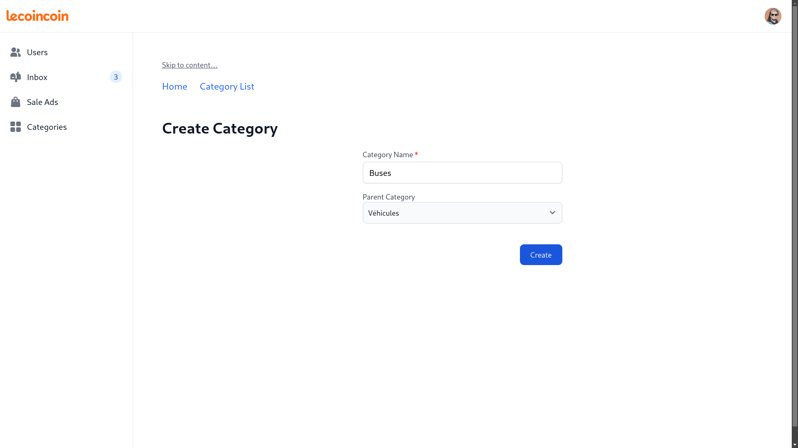
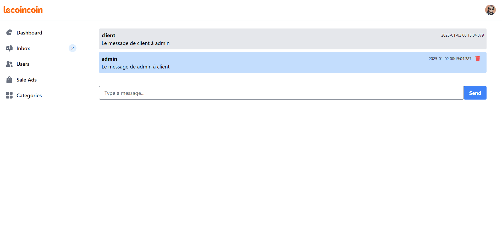
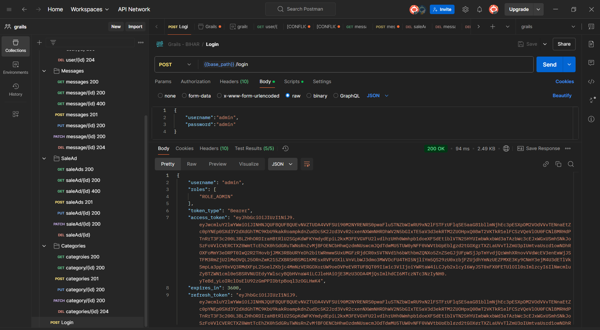
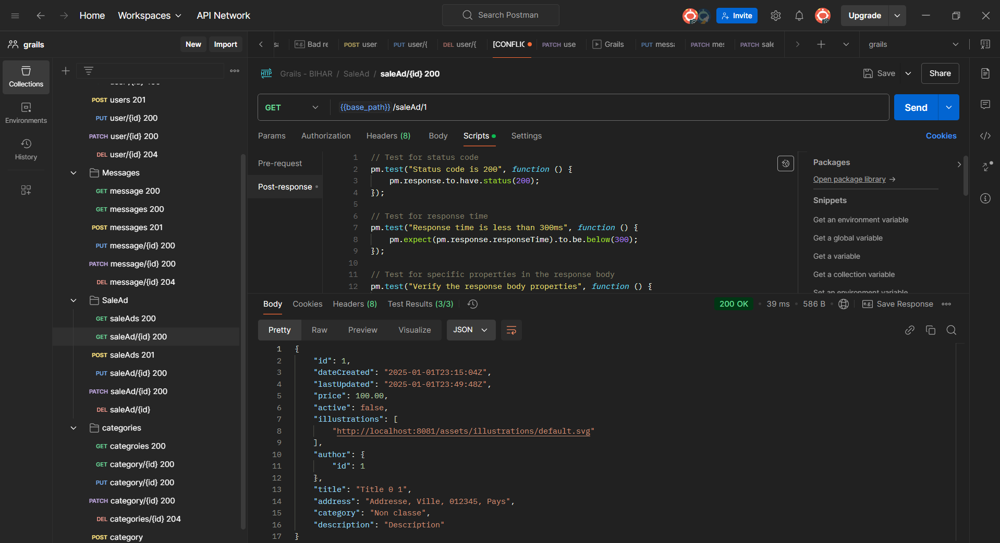

# ReadMe: Plateforme de Petites Annonces

## Table des Matières

- [Introduction](#introduction)
- [Prérequis](#prérequis)
- [Lancer le Projet en Local](#lancer-le-projet-en-local)
- [Fonctionnalités Clés](#fonctionnalités-clés)
- [Rôles et Privilèges](#rôles-et-privilèges)
- [Structure des Entités](#structure-des-entités)
- [API REST](#api-rest)
- [Documentation de l'API](#documentation-de-lapi)
- [Captures d'Écran](#captures-décran)
- [Bilan](#bilan)
- [Auteurs](#auteurs)

## Introduction

Ce projet est une plateforme de petites annonces inspirée de "Leboncoin", réalisée avec le framework Grails v5.3.6. Elle propose une interface d'administration et une API REST pour gérer les utilisateurs, les annonces, le categories d'annonces, les images d'annonces, et la messagerie entre utilsateurs.

## Prérequis

### Logiciels nécessaires

- Java 11+
- Grails v5.3.6
- IDE compatible (IntelliJ, VS Code, etc.)

### Installation des dépendances

Exécutez la commande suivante dans le répertoire racine du projet :

```bash
grails dependencies
```

---

## Lancer le Projet en Local

1. Clonez le dépôt :

```bash
git clone https://github.com/BIHAR-ESTIA/grails-et-rest-sm.git
```

2. Configurez les paramètres de la base de données dans le fichier `application.yml`.
3. Lancez le serveur Grails :

```bash
grails run-app
```

4. Accédez à l'application sur [http://localhost:8081](http://localhost:8081).

## Captures d'Écran

### Authentification


### Gestion des utilisateurs



### Gestion des annonces

#### /index



#### /create



#### /show



### Gestion des categories

#### /index



#### /create



### Messagerie

#### /index


#### /conversation



---

## Fonctionnalités Clés
L'interface d'administration de la plateforme permet de :
- Gérer les utilisateurs et leurs rôles.
- Créer, lire, mettre à jour et supprimer des annonces.
- Associer des images aux annonces via un système d'upload.
- Associer les annonces à des catégories.
- Configurer les informations d'adresse pour chaque annonce.
- Accéder à une messagerie privée entre utilisateurs.

## Rôles et Privilèges

| Rôle        | Privilèges                                                                                                                                                             |
| ----------- | ---------------------------------------------------------------------------------------------------------------------------------------------------------------------- |
| ROLE_ADMIN  | - Gestion des utilisateurs. <br> - Gestion des annonces. <br> - Gestion des catégories. <br> - Envoi et lecture de ses messages                                        |
| ROLE_MODO   | - Gestion des annonces. <br> - Gestion des catégories.<br> - Envoi et lecture de ses messages                                                                          |
| ROLE_CLIENT | - Gestion de son compte.<br> - Création, modification et suppression de ses propres annonces. <br> - Envoi et lecture de ses messages. <br> - Voir toutes les annonces. |

## Structure des Entités

### User

- **Propriétés** : `id`, `username`, `password`, `email`, `phone`, `roles`.
- **Rôles disponibles** : `ADMIN_ROLE`, `MODO_ROLE`, `USER_ROLE`.

### Role

- **Propriétés** : `id`, `roleName`.

### SaleAd

- **Propriétés** : `id`, `title`, `description`, `price`, `category`, `user`, `illustrations`.

### Category

- **Propriétés** : `id`, `name`, `parent`

### Illustration

- **Propriétés** : `id`, `FileName`

### Message

- **Propriétés** : `id`, `author`, `dest`, `content`, `isRead`, `dateCreated`.

### Address

- **Propriétés** : `id`, `address`, `postCode`, `city`, `country`.

## API REST

L'API REST fournit des fonctionnalités robustes pour interagir avec les entités :

- **Gestion des utilisateurs** :
  - Récupération de la liste des utilisateurs.
  - Création, mise à jour, et suppression d'utilisateurs.
  - Attribution de rôles.
- **Gestion des annonces** :
  - Récupération de toutes les annonces ou d'une annonce spécifique.
  - Création, modification et suppression d'annonces.
- **Gestion des catégories** :
  - Récupération de la liste des catégories.
  - Ajout, édition et suppression de catégories.
- **Gestion des messages** :
  - Envoi de messages privés.
  - Récupération des messages liés à un utilisateur.
- **Gestion des adresses** :
  - Ajout et modification des adresses pour les annonces.

### Documentation de l'API

- Une documentation Postman détaillée est incluse.
- Le fichier `collection.json` est disponible dans le répertoire `src/main/docs/`.
- Exemples de requêtes pour chaque endpoint.

Authentification



Get SaleAds



### Tester l'API avec Postman

1. Importez la collection Postman depuis `src/tests/Postman/collection.json`.
2. Configurez l'URL de base dans les variables d'environnement.
3. Exécutez les requêtes prédéfinies pour valider les endpoints.

## Bilan

Ce projet nous a permis de découvrir et de mettre en application les concepts suivants :

- Les bases de données relationnelles avec GORM
- La sécurité avec Spring Security
- Les API REST avec Grails
- La gestion des erreurs et des exceptions
- La documentation de l'API avec Postman
- L'utilisation de Postman pour tester l'API
- L'utilisation de bootstrap / Tailwind pour la mise en page
- La mise en place d'un système de messagerie instantanée

Nous avons également appris à utiliser des outils tels que Gradle, Git et Postman.

Enfin, nous avons appris à gérer les dépendances et les problèmes de compatibilité entre les différentes versions de Grails et de ses dépendances.

## Auteurs

- [Said Abderrahmane](https://github.com/saidabderrahmane)
- [ Mahdi DADDI HAMMOU](https://github.com/mahdidhammou)
